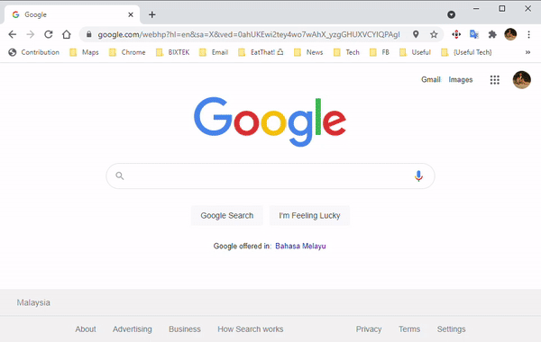

# Chrome mouse gesture extension

- [Features](#Features)
- [Installation](#Installation)
- [Limitation](#LIMITATION)
- [Releases](#Releases)
- [Report Bug](#Report-Bug)

I've been using crxMouse for many years and it serves me well but it has gone rouge by sending lots of analytics data back it's server of unknown origin. hence I've decided to build my own.

## Features

It currently only support 5 gestures and fixed command now. Just hold you right click button and drag Gesture as per below list and release your right button to trigger command below:-

- **Gesture LEFT** - Page back
- **Gesture Right** - Page forward
- **Gesture Up** Open new tab
- **Gesture Down** Close current tab
- **Gesture Up, Down** Undo close tab

  

## Installation

This has not been published into Chrome Web Store yet because i don't have a Chrome Web Store developer account yet and seems like there is more process of creating end user license agreement and usage policy etc just to publish it. So for now if you need mouse gesture that you can trust just follow below steps

1. Download latest version from [Releases](#Releases) section
2. unzip it to you desired location
3. In chrome menu select `More Tools` => `Extensions`
4. Enable `Developer Mode` switch on top right corner
5. Click `Load Unpacked` and browse to the unzipped chrogesture-extension `dist` folder
6. Restart your chrome browser and this Chrogesture-Extension is ready for use.
7. Done

## Limitation

Because of the limitation with chrome extension APIs, there are several limitation to this extension. below are the list of limitations

- Can't configure command or add new gestures for now.
- Gesture doesn't work when mouse cursor over IFrame.
  - IFrame is widely used to display Ads and also embedded YouTube videos and embedded Facebook Images and etc.
  - Browser IFrame is a special element where any Mouse Event will not have effect, hence this gesture cannot detect when you hold the right mouse or release the right mouse when it's over IFrame
  - Third party server event bubbling will not bubble into main webpage, the reason for this is to protect users sensitive data from third party like Ads network.
  - There is a workaround for this is to force event bubbling over IFrame but will disable you from interacting with IFrame. Mean you wont be able to click on Ads
  - To force that feature check the checkbox `Enable gesture over IFrame` 
  - Once this is enabled, you can use gesture over IFrame but interaction with the Ads will be disabled as well through adding css `pointer-event: none` to all IFrame [read more here](https://developer.mozilla.org/en-US/docs/Web/CSS/pointer-events)
  - But you might want to interact with IFrames.
  - To start to interact with IFrame, click once on it and it will disengaged `pointer-event: none` on that IFrame. Then you can click on the Ads
- Gesture wont work in any Chrome System page. This is because no third party extension should be able to interact with your chrome system data, this includes:-
  - New Tab
  - Chrome Setting Tab
  - Chrome Download Tab

## Releases

Download latest version below and unzip it to you desired path

- [chrogesture-extension-v0.2.0.zip](/releases/chrogesture-extension-v0.2.0.zip)

## Report Bug

You may report bugs in this GitHub Issues page
